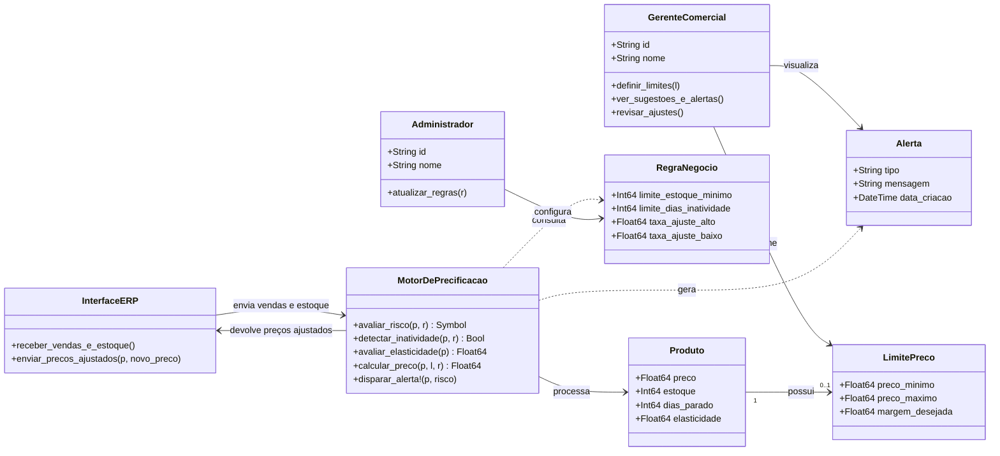
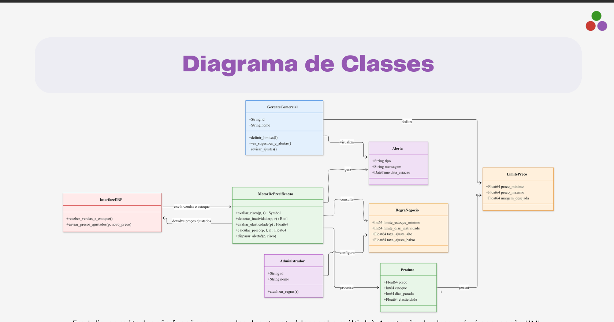

# Diagrama de Classes

Em Julia os métodos são funções separadas dos structs (despacho múltiplo). A notação de classe abaixo segue a convenção UML.

```mermaid
classDiagram
    direction LR

    class GerenteComercial {
        +String id
        +String nome
        +definir_limites(l)
        +ver_sugestoes_e_alertas()
        +revisar_ajustes()
    }

    class Administrador {
        +String id
        +String nome
        +atualizar_regras(r)
    }

    class InterfaceERP {
        +receber_vendas_e_estoque()
        +enviar_precos_ajustados(p, novo_preco)
    }

    class MotorDePrecificacao {
        +avaliar_risco(p, r) Symbol
        +detectar_inatividade(p, r) Bool
        +avaliar_elasticidade(p) Float64
        +calcular_preco(p, l, r) Float64
        +disparar_alerta!(p, risco)
    }

    class Alerta {
        +String tipo
        +String mensagem
        +DateTime data_criacao
    }

    class RegraNegocio {
        +Int64 limite_estoque_minimo
        +Int64 limite_dias_inatividade
        +Float64 taxa_ajuste_alto
        +Float64 taxa_ajuste_baixo
    }

    class LimitePreco {
        +Float64 preco_minimo
        +Float64 preco_maximo
        +Float64 margem_desejada
    }

    class Produto {
        +Float64 preco
        +Int64 estoque
        +Int64 dias_parado
        +Float64 elasticidade
    }

    InterfaceERP --> MotorDePrecificacao : envia vendas e estoque
    MotorDePrecificacao --> InterfaceERP : devolve preços ajustados
    GerenteComercial --> LimitePreco : define
    GerenteComercial --> Alerta : visualiza
    MotorDePrecificacao ..> Alerta : gera
    MotorDePrecificacao ..> RegraNegocio : consulta
    MotorDePrecificacao --> Produto : processa
    Administrador --> RegraNegocio : configura
    Produto "1" --> "0..1" LimitePreco : possui
```

## Imagem original

