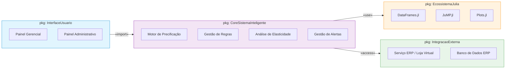
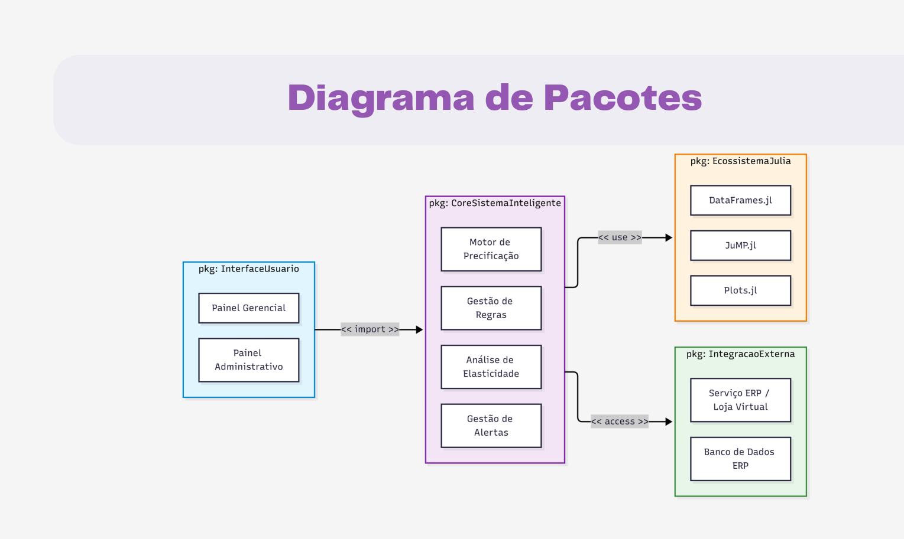

# Diagrama de Pacotes

O Mermaid não tem diagrama de pacotes; os pacotes aparecem como agrupamentos de um fluxograma.

```mermaid
flowchart LR
    subgraph InterfaceUsuario["pkg: InterfaceUsuario"]
        direction TB
        PG["Painel Gerencial"]
        PA["Painel Administrativo"]
    end

    subgraph CoreSistemaInteligente["pkg: CoreSistemaInteligente"]
        direction TB
        MP["Motor de Precificação"]
        GR["Gestão de Regras"]
        AE["Análise de Elasticidade"]
        GA["Gestão de Alertas"]
    end

    subgraph EcossistemaJulia["pkg: EcossistemaJulia"]
        direction TB
        DF["DataFrames.jl"]
        JM["JuMP.jl"]
        PL["Plots.jl"]
    end

    subgraph IntegracaoExterna["pkg: IntegracaoExterna"]
        direction TB
        ERP["Serviço ERP / Loja Virtual"]
        BD["Banco de Dados ERP"]
    end

    InterfaceUsuario -->|"«import»"| CoreSistemaInteligente
    CoreSistemaInteligente -->|"«use»"| EcossistemaJulia
    CoreSistemaInteligente -->|"«access»"| IntegracaoExterna

    style InterfaceUsuario fill:#E1F5FE,stroke:#0288D1
    style CoreSistemaInteligente fill:#F3E5F5,stroke:#8E24AA
    style EcossistemaJulia fill:#FFF3E0,stroke:#FB8C00
    style IntegracaoExterna fill:#E8F5E9,stroke:#43A047
```

## Imagem original

