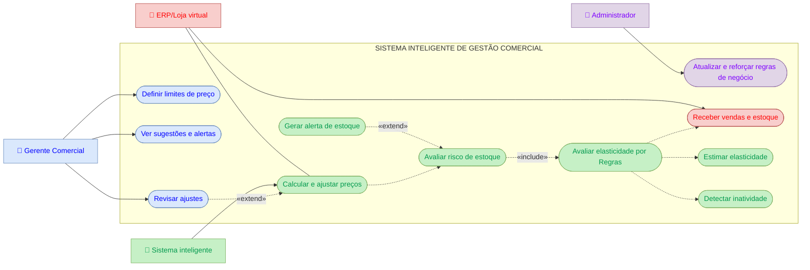
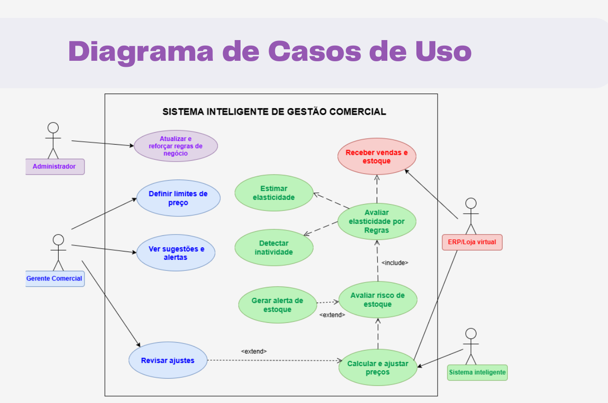

# Diagrama de Casos de Uso

O Mermaid não tem diagrama de casos de uso; os atores aparecem como retângulos e os casos de uso como elipses (formato estádio).

```mermaid
flowchart LR
    ADM["🧍 Administrador"]
    GER["🧍 Gerente Comercial"]
    ERP["🧍 ERP/Loja virtual"]
    SIS["🧍 Sistema inteligente"]

    subgraph SISTEMA["SISTEMA INTELIGENTE DE GESTÃO COMERCIAL"]
        UC1(["Atualizar e reforçar regras de negócio"])
        UC2(["Definir limites de preço"])
        UC3(["Ver sugestões e alertas"])
        UC4(["Revisar ajustes"])
        UC5(["Receber vendas e estoque"])
        UC6(["Estimar elasticidade"])
        UC7(["Detectar inatividade"])
        UC8(["Avaliar elasticidade por Regras"])
        UC9(["Gerar alerta de estoque"])
        UC10(["Avaliar risco de estoque"])
        UC11(["Calcular e ajustar preços"])
    end

    ADM --> UC1
    GER --> UC2
    GER --> UC3
    GER --> UC4
    ERP --> UC5
    ERP --- UC11
    SIS --> UC11

    UC8 -.-> UC5
    UC8 -.-> UC6
    UC8 -.-> UC7
    UC10 -. "«include»" .-> UC8
    UC9 -. "«extend»" .-> UC10
    UC11 -.-> UC10
    UC4 -. "«extend»" .-> UC11

    classDef admin fill:#E1D5E7,stroke:#9673A6,color:#7F00FF
    classDef gerente fill:#DAE8FC,stroke:#6C8EBF,color:#0000FF
    classDef erp fill:#F8CECC,stroke:#B85450,color:#FF0000
    classDef sistema fill:#C6F0C6,stroke:#82B366,color:#00994D

    class ADM,UC1 admin
    class GER,UC2,UC3,UC4 gerente
    class ERP,UC5 erp
    class SIS,UC6,UC7,UC8,UC9,UC10,UC11 sistema
```

## Imagem original

