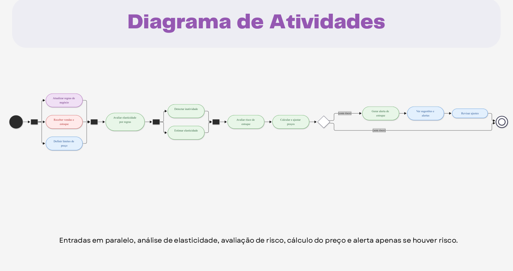

# Diagrama de Atividades

Entradas em paralelo, análise de elasticidade, avaliação de risco, cálculo do preço e alerta apenas se houver risco.

```mermaid
flowchart LR
    INICIO(( )) --> F1[ ]

    F1 --> A1(["Atualizar regras de negócio"])
    F1 --> A2(["Receber vendas e estoque"])
    F1 --> A3(["Definir limites de preço"])

    A1 --> J1[ ]
    A2 --> J1
    A3 --> J1

    J1 --> A4(["Avaliar elasticidade por regras"])
    A4 --> F2[ ]

    F2 --> A5(["Detectar inatividade"])
    F2 --> A6(["Estimar elasticidade"])

    A5 --> J2[ ]
    A6 --> J2

    J2 --> A7(["Avaliar risco de estoque"])
    A7 --> A8(["Calcular e ajustar preços"])
    A8 --> D{ }

    D -->|"[com risco]"| A9(["Gerar alerta de estoque"])
    A9 --> A10(["Ver sugestões e alertas"])
    A10 --> A11(["Revisar ajustes"])
    A11 --> FIM((( )))
    D -->|"[sem risco]"| FIM

    classDef barra fill:#222,stroke:#222
    classDef inicio fill:#222,stroke:#222
    classDef admin fill:#F3E5F5,stroke:#9673A6,color:#6A1B9A
    classDef erp fill:#FFEBEE,stroke:#E57373,color:#C62828
    classDef gerente fill:#E3F2FD,stroke:#64B5F6,color:#1565C0
    classDef sistema fill:#E8F5E9,stroke:#81C784,color:#2E7D32

    class F1,J1,F2,J2 barra
    class INICIO inicio
    class A1 admin
    class A2 erp
    class A3,A10,A11 gerente
    class A4,A5,A6,A7,A8,A9 sistema
```

## Imagem original

