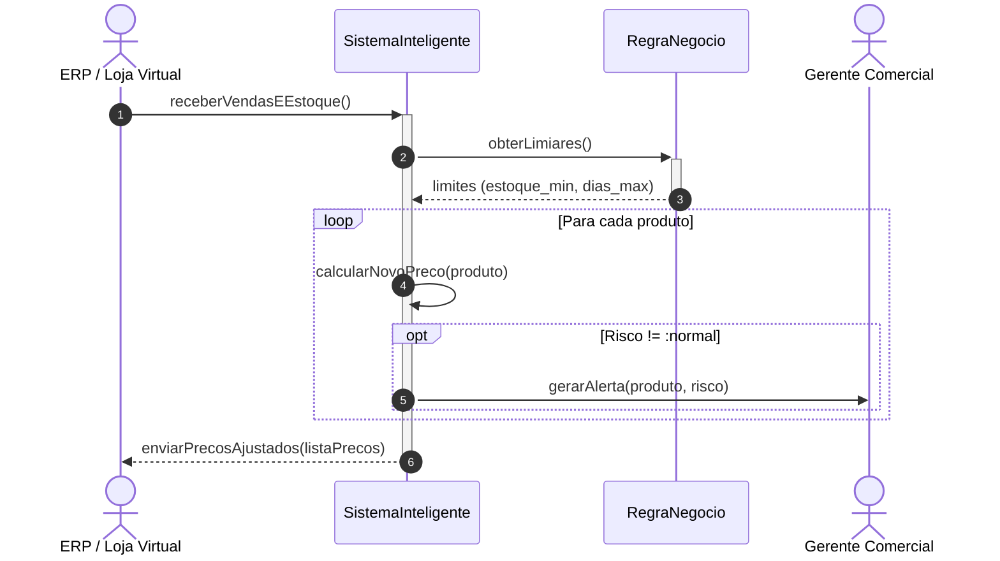
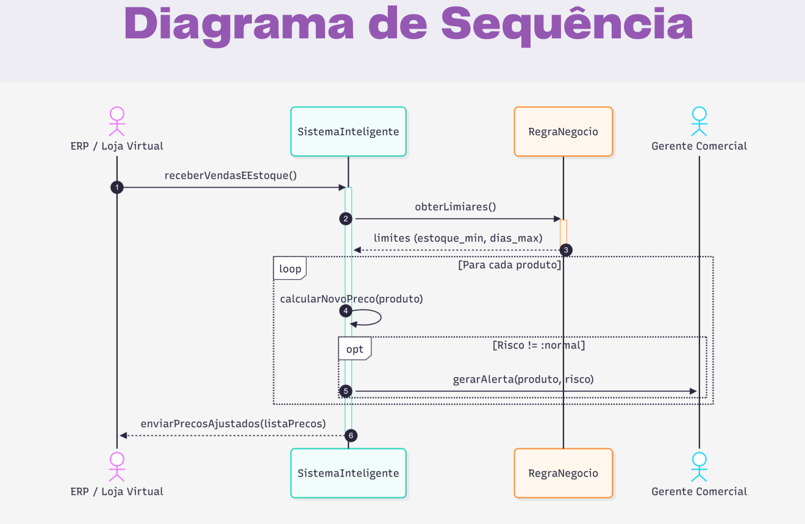

# Diagrama de Sequência

```mermaid
sequenceDiagram
    autonumber
    actor ERP as ERP / Loja Virtual
    participant SI as SistemaInteligente
    participant RN as RegraNegocio
    actor GC as Gerente Comercial

    ERP->>+SI: receberVendasEEstoque()
    SI->>+RN: obterLimiares()
    RN-->>-SI: limites (estoque_min, dias_max)

    loop Para cada produto
        SI->>SI: calcularNovoPreco(produto)
        opt Risco != :normal
            SI->>GC: gerarAlerta(produto, risco)
        end
    end

    SI-->>-ERP: enviarPrecosAjustados(listaPrecos)
```

## Imagem original

