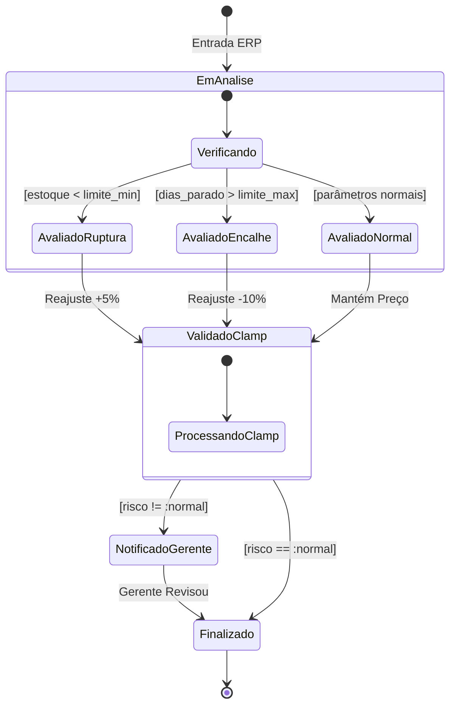
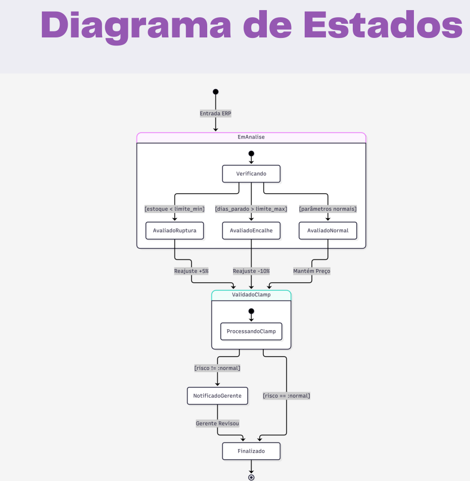

# Diagrama de Estados

```mermaid
stateDiagram-v2
    [*] --> EmAnalise : Entrada ERP

    state EmAnalise {
        [*] --> Verificando
        Verificando --> AvaliadoRuptura : [estoque < limite_min]
        Verificando --> AvaliadoEncalhe : [dias_parado > limite_max]
        Verificando --> AvaliadoNormal : [parâmetros normais]
    }

    AvaliadoRuptura --> ValidadoClamp : Reajuste +5%
    AvaliadoEncalhe --> ValidadoClamp : Reajuste -10%
    AvaliadoNormal --> ValidadoClamp : Mantém Preço

    state ValidadoClamp {
        [*] --> ProcessandoClamp
    }

    ValidadoClamp --> NotificadoGerente : [risco != #colon;normal]
    ValidadoClamp --> Finalizado : [risco == #colon;normal]
    NotificadoGerente --> Finalizado : Gerente Revisou
    Finalizado --> [*]
```

## Imagem original

