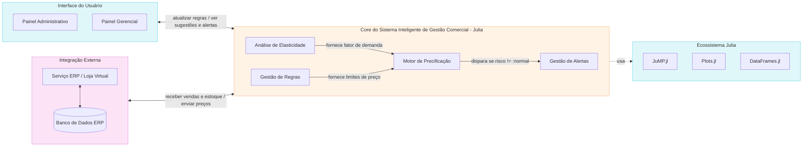
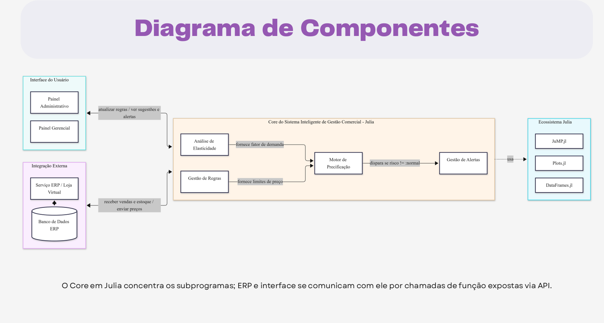

# Diagrama de Componentes

O Core em Julia concentra os subprogramas; ERP e interface se comunicam com ele por chamadas de função expostas via API.

```mermaid
flowchart LR
    subgraph UI["Interface do Usuário"]
        direction TB
        PA["Painel Administrativo"]
        PG["Painel Gerencial"]
    end

    subgraph EXT["Integração Externa"]
        direction TB
        ERP["Serviço ERP / Loja Virtual"]
        BD[("Banco de Dados ERP")]
        ERP <--> BD
    end

    subgraph CORE["Core do Sistema Inteligente de Gestão Comercial - Julia"]
        direction LR
        AE["Análise de Elasticidade"]
        GR["Gestão de Regras"]
        MP["Motor de Precificação"]
        GA["Gestão de Alertas"]
        AE -->|fornece fator de demanda| MP
        GR -->|fornece limites de preço| MP
        MP -->|"dispara se risco != :normal"| GA
    end

    subgraph ECO["Ecossistema Julia"]
        direction TB
        JM["JuMP.jl"]
        PL["Plots.jl"]
        DF["DataFrames.jl"]
    end

    UI <-->|atualizar regras / ver sugestões e alertas| CORE
    EXT <-->|receber vendas e estoque / enviar preços| CORE
    CORE -.->|usa| ECO

    style UI fill:#E0F7FA,stroke:#4DD0E1
    style EXT fill:#FCE4F6,stroke:#E57FD8
    style CORE fill:#FFF3E6,stroke:#F0B27A
    style ECO fill:#E0F7FA,stroke:#4DD0E1
```

## Imagem original

